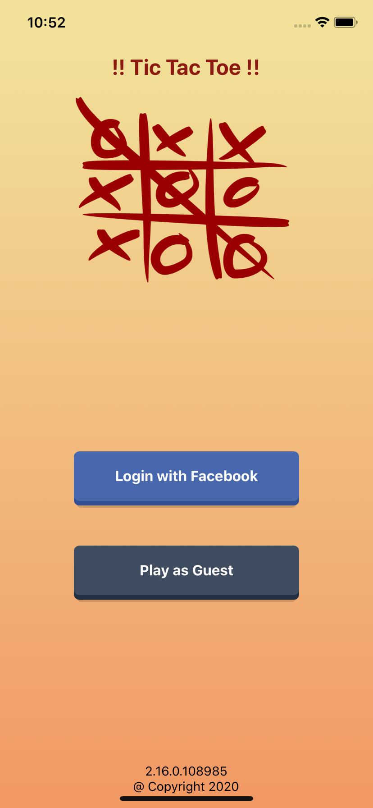
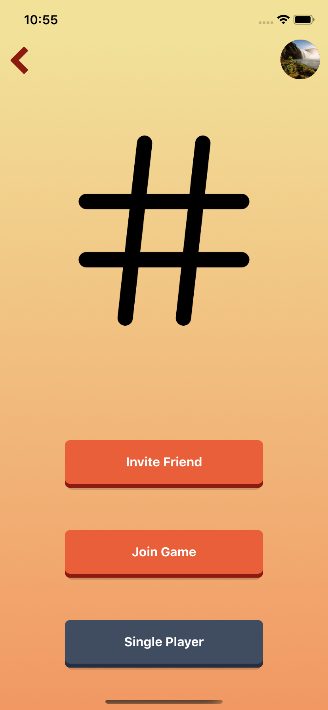

[](https://travis-ci.org/vtapadia/TicTacToeApp)

App in react-native for Tic Tac Toe game.
Status: In development

### Testing

The APP is continuously deployed using the expo platform and can be downloaded via 
- Installing the "expo client" 
- Visit site https://expo.io/@varesh.tapadia/TicTacToeApp
- Access the URL via camera or Expo Client App.

Enjoy :)

### Demo
 


### Continuous Integration
The App use travis-ci for continuous build and deploy to expo server.

### References
[react-native-vector-icons examples](https://oblador.github.io/react-native-vector-icons/)
Code: https://github.com/oblador/react-native-vector-icons
To see all the icons: https://oblador.github.io/react-native-vector-icons/

WebSocket Server protocol used : NES
https://github.com/hapijs/nes/blob/master/PROTOCOL.md

Buttons, using react native awesome-buttons
https://github.com/rcaferati/react-native-really-awesome-button
Defined my Custom buttons and theme and used that to define global buttons.
Demo site to test buttons: https://caferati.me/demo/react-awesome-button/morty-theme

### Colors and Themes
Referred to https://uxplanet.org/the-secret-of-great-gradient-2f2c49ef3968 where one understand how to choose colors.

### NPM Commands
To Get all the globall listed packages
```bash
npm list -g --depth 0
```
